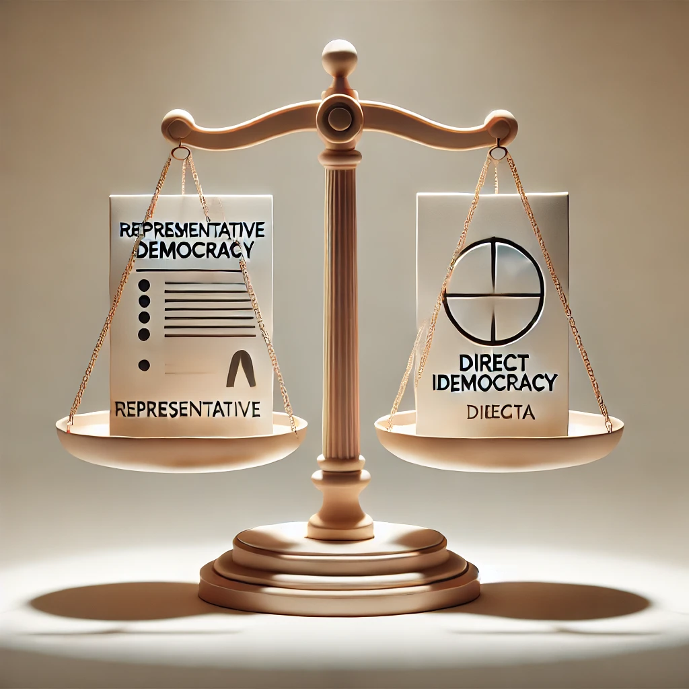
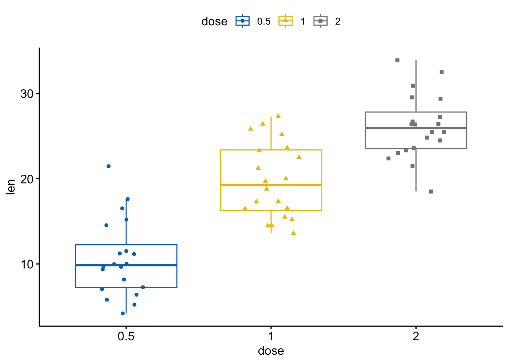

DIGIPOLS focuses on the intersection of digital technologies and politics. Our mission is to provide a research environment for pursuing cutting-edge, theory-driven empirical research on how digital technologies are impacting our institutions of governance and how politics shapes the development of these technologies.

## Spotlight

```{=html}
<div id="spotlight" class="carousel slide" data-bs-ride="carousel" data-bs-interval="5000">
  <div class="carousel-indicators">
    <button type="button" data-bs-target="#spotlight" data-bs-slide-to="0" class="active" aria-current="true" aria-label="Slide 1"></button>
    <button type="button" data-bs-target="#spotlight" data-bs-slide-to="1" aria-label="Slide 2"></button>
    <button type="button" data-bs-target="#spotlight" data-bs-slide-to="2" aria-label="Slide 3"></button>
  </div>
  <div class="carousel-inner">
    <div class="carousel-item active">
      
      <div class="carousel-caption d-none d-md-block bg-dark bg-opacity-50 rounded p-2">
        <h5>Voting Advice Applications</h5>
        <p>Pioneering research on digital tools that help citizens make informed voting decisions.</p>
      </div>
    </div>
    <div class="carousel-item">
      
      <div class="carousel-caption d-none d-md-block bg-dark bg-opacity-50 rounded p-2">
        <h5>EU Media Monitoring</h5>
        <p>Real-time data collection and analysis of political communication across European media.</p>
      </div>
    </div>
    <div class="carousel-item">
      
      <div class="carousel-caption d-none d-md-block bg-dark bg-opacity-50 rounded p-2">
        <h5>Public Opinion Research</h5>
        <p>Advanced techniques for analysing public opinion using surveys and computational methods.</p>
      </div>
    </div>
  </div>
  <button class="carousel-control-prev" type="button" data-bs-target="#spotlight" data-bs-slide="prev">
    <span class="carousel-control-prev-icon" aria-hidden="true"></span>
    <span class="visually-hidden">Previous</span>
  </button>
  <button class="carousel-control-next" type="button" data-bs-target="#spotlight" data-bs-slide="next">
    <span class="carousel-control-next-icon" aria-hidden="true"></span>
    <span class="visually-hidden">Next</span>
  </button>
</div>
```
